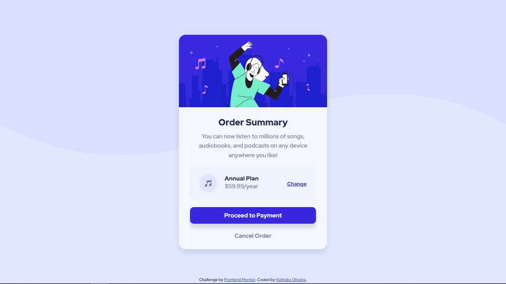
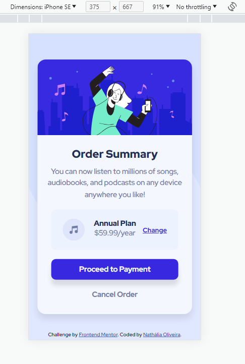

# Frontend Mentor - Order summary card solution

This is a solution to the [Order summary card challenge on Frontend Mentor](https://www.frontendmentor.io/challenges/order-summary-component-QlPmajDUj). Frontend Mentor challenges help you improve your coding skills by building realistic projects. 

## Table of contents

- [Frontend Mentor - Order summary card solution](#frontend-mentor---order-summary-card-solution)
  - [Table of contents](#table-of-contents)
  - [Overview](#overview)
    - [The challenge](#the-challenge)
    - [Screenshot](#screenshot)
    - [Links](#links)
  - [My process](#my-process)
    - [Built with](#built-with)
    - [What I learned](#what-i-learned)
    - [Continued development](#continued-development)
    - [Useful resources](#useful-resources)
  - [Author](#author)

## Overview

### The challenge

Users should be able to:

- See hover states for interactive elements

### Screenshot

Add a screenshot of your solution. The easiest way to do this is to use Firefox to view your project, right-click the page and select "Take a Screenshot". You can choose either a full-height screenshot or a cropped one based on how long the page is. If it's very long, it might be best to crop it.

Alternatively, you can use a tool like [FireShot](https://getfireshot.com/) to take the screenshot. FireShot has a free option, so you don't need to purchase it. 

Then crop/optimize/edit your image however you like, add it to your project, and update the file path in the image above.

**Note: Delete this note and the paragraphs above when you add your screenshot. If you prefer not to add a screenshot, feel free to remove this entire section.**

### Links

- Solution URL: [GitHub Solution](https://github.com/nathsantoliver/order-summary-component-main/)
- Live Site URL: [Order Summary Card](https://order-summary-component-main-one-pi.vercel.app/)

## My process

### Built with

- Semantic HTML5 markup
- CSS custom properties
- Flexbox

### What I learned

I learned that in the construction of a layout, as simple as it may seem, concepts can be merged so that the construction is better understood by other people who read the code.

### Continued development

I need to delve into box model concepts, know the best time to use flexbox or grid. Training in these concepts is important for my skills in building a layout to be done in a more fluid and harmonious way.
### Useful resources

- [W3Schools CSS Tutorial](https://www.w3schools.com/css) - This helped me to understand their concepts and application examples, making me understand if it is valid to apply that concept in the code or not.
- [CSS-Tricks Snippets](https://css-tricks.com/snippets/css/) - Like W3Schools, CSS trick helped me to understand concepts, mainly the applicability of flexbox and css grid, and the best way to style the page using these concepts.

## Author

- Frontend Mentor - [@nathsantoliver](https://www.frontendmentor.io/profile/nathsantoliver)
- GitHub - [@nathsantoliver](https://github.com/nathsantoliver)
